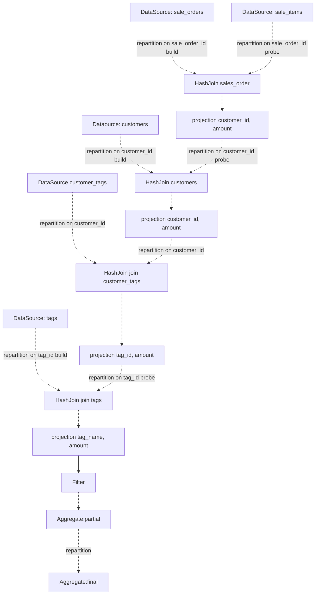

# datafusion 分析

-[ ] samply 分析
     - 透过 samply 了解 datafusion 的执行流程，尤其是异步处理，目标输出一份 datafusion 的物理执行计划分析文档
     - 对 async 这一块的开销评估
     - 观察一下 datafusion 的执行计划中的时间消耗
       - IO、压缩等耗时如何？
       - join 的开销
       - window function 的执行开销
       - 计算的执行开销

1. cpu 跑不到 100%
2. tokio::Context:park + 其他：~6%
3. 是否有不合理的 RepartitionExec?
4. DataSourceExec 是否有分区执行？每个分区处理一部分数据？对 parquet 输入，IO + 解压缩 方面耗时如何？

# query case 4-4 where tag_name = 'tagx'
1. duckdb, 0.179s
    - sale_items(20480) hashjoin sale_orders(20M)  0.74s
    - (sale_items, sale_orders) (20480) hashjoin customers(1M) 0.08s
    - left (20480) hashjoin customer_tags(8M) 0.31s
    - left (20480) hashjoin tags(0) 0.0s

2. datafusion: 5.22s 
    其耗时基本与 tagx 是一致

# query case 4-5 where tag_name = 'tag1'
1. duckdb, 1.57s
    - sale_items(80M) hashjoin sale_orders(20M)  2.35s
    - left (80M) hashjoin customers(1M) 2.01s
    - left (80M) hashjoin customer_tags(8M) 7.16s   为什么长：输出行数多
    - left (640M) hashjoin tags(1) 1.30s
   理论上还可能更快, 如果 hashjoin customer_tags 的 build table 进行过滤，行数还会减少。

2. datafusion: 5.26s
    - sale_items(80M) hashjoin sale_orders(20M)  build: 863ms join: 3.43s
    - left (80M) hashjoin customers(1M) 2.01s    build: 15ms, join: 2.94s
    - left (80M) hashjoin customer_tags(8M) 7.16s   build: 198ms  join: 15.344s
    - left (640M) hashjoin tags(1) 1.30s            build: 9ms   join: 7.86s
    看上去， hash-join 这一块的性能差异 慢了1倍以上。

评估：
- hashjoin 的实现效率低于 duckdb
- 对查询计划的优化不到位
- 执行计划的额外开销？
- 对比 duckdb 的 samply. duckdb 模式的调用栈更简单。datafusion 的调用栈要复杂很多。 
