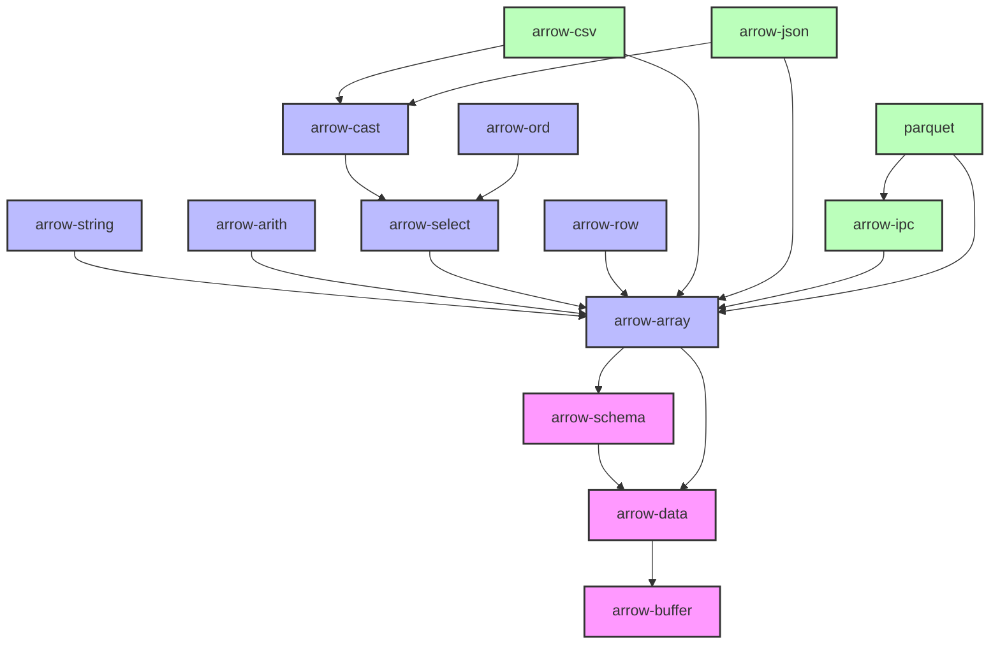

# 练习 arrow 的项目

1. 理解 arrow spec: https://arrow.apache.org/docs/format/Columnar.html
   - IPC file format: 
     - write users.arrow file: poc/try_arrow/src/main.rs#test2 
     - read users.arrow file using FileReader: not zero copy version: poc/try_arrow/src/main.rs#test3
     - read users.arrow file using zero copy version: poc/try_arrow/src/main.rs#test5
     - 对照理解 spec/{File, Message, Schema}.fbs 理解 arrow 的文件格式，通过单步调试 test5 的代码来理解 arrow 的文件格式
2. 理解 arrow 的核心数据结构
   - 理解 arrow 的数据结构，通过单步调试 test5 的代码来理解 arrow 的数据结构
   - XXXArray 与 ArrayData 的关系。

# Arrow 的数据结构
1. struct PrimitiveArray<T>
   ```
   struct PrimitiveArray<T: ArrowPrimitiveType> {  // ArrowPrimitiveType { type Native, const DATA_TYPE }
       data_type: DataType,
       values: ScalarBuffer<T::Native> {  // 数据其实不是模版展开的，只是操作会展开
         buffer: Buffer {
            data: Arc<Bytes>,  // Bytes { ptr: NonNull<u8>, len: usize, deallocations } 
            ptr: *const u8,   // ptr[0..len] maybe inside data
            len: usize,
         }
       }
       nulls: Option<NullBuffer>
   }
   ```
   - Bytes 是底层的存储，使用 Arc，可以被多个 Buffer 共享。deallocation 决定其计数归零时是否释放内存。
     - 如果 Bytes 的 ptr 是从 mmap 中获得的，那么其释放交给 mmap 管理。
     - 如果 Bytes 是 标准分配模式，则 drop。 
   - Buffer 是 Bytes 的一个 View
   - `ScalarBuffer<T>` 是 Buffer 的一个类型化访问器。其本身不存储数据，只是提供类型化的访问接口。
   - OffsetBuffer<i32|i64> 是 ScalaBuffer<i32|i64> 的一个特例。

# arrow crates


- core
  - arrow-buffer
  - arrow-data
  - arrow-schema
  - arrow-array
- operation
  - arrow-string: 字符串操作, like, regexp 等。
  - arrow-arith：算术运算，包括聚合计算等。
  - arrow-select: 数据选择和过滤操作
    - arrow-cast: 数据类型转换
    - arrow-ord: 排序操作
  - arrow-row: 包含多列的行（struct 概念）的array.
- format
  - arrow-ipc: arrow 文件读写
  - arrow-csv: csv 文件读写
  - arrow-json: json 文件读写
  - parquet: parquet 文件读写

## Questions
1. how to debug flatbuffers code? 
2. how to debug &dyn Array?
3. how to debug rust code with expression evaluation?
4. learn datafusion